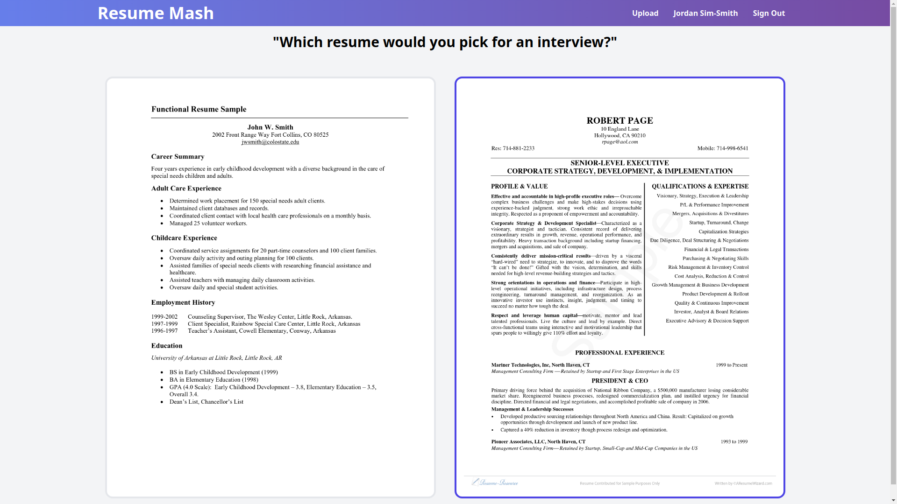

# Resume Mash
ResumeMash is a web application for ranking and receiving feedback on resumes.

## Features
  Users can:
1. submit resumes to be reviewed.
1. pick a winner between a random matchup of two resumes.
1. view the list of resumes they have submitted.
1. see how other users have rated their resumes (wins and losses).

## Technologies
1. ASP.NET Core, EF Core, MariaDB, AWS S3
1. React.js, Next.js, Tailwind CSS
1. Auth0
